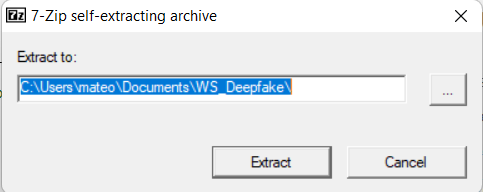
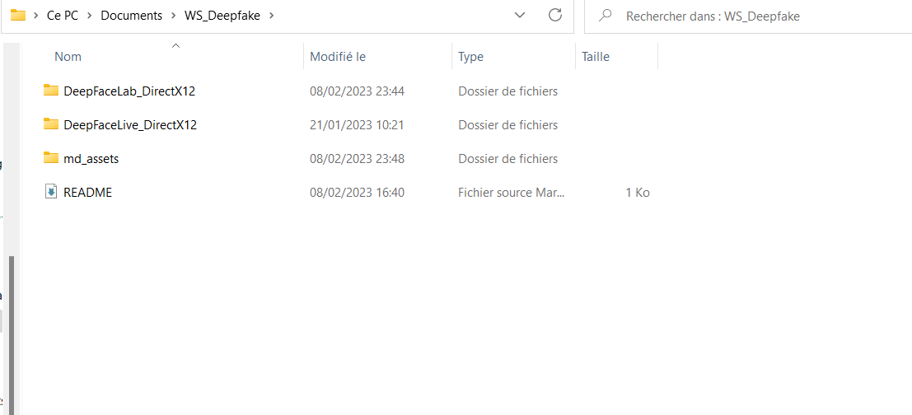

# WorkShop Deepfake
## Déroulement du WorkShop

Ce WS qui se présente sous forme de "tuto" est créé spécifiquement pour faire du deepfake en LIVE et pas faire du faceswap parfait sur des vidéos mais si cela vous intéresse venez me poser des questions.

- Installer les logiciels et les scripts pour entrainer un modèle
- Créer un dataset
- Nettoyer un dataset 
- Entrainer un modèle
- Exporter un modèle
- Utiliser un modèle (sur Teams/Discord/Twitch)

## Requirement
Numpy, pip, python et DirectX12

DirectX12 (Carte graphique compatible).
(Recommandé RTX 2070+ / Radeon RX 5700 XT+).
CPU Moderne (Ryzen 7 5k+/intel I7 9k+).
4GB RAM, 32GB+ place.
Windows 10.
(Si vous êtes sur linux et que vous n'avez pas Windows installez un VM ou débrouillez vous.)

## Installation

Téléchargez deepfacelive et DeepFaceLab AVEC EN FONCTION DE VOTRE MATERIEL !!!
https://drive.google.com/drive/folders/1sqmYvEE7o6Hhci7qxUSSJpmJwh7S99A0?usp=sharing
(Exemple : Si vous avez une RTX 2070 vous prenez 'DeepFaceLab_NVIDIA_up_to_RTX2080Ti...')

Lancez les 2 .exe pour extraire les fichiers dans votre dossier :

Vous devriez avoir un truc qui ressemble à ça :

## 1. Le Data Set  

### 1.1 Trouver la vidéo et extraire les gens

Tout d'abord allez dans le dossier DeepFaceLab_XXXXXXXX\workspace et supprimez les fichier vidéo data_src et data_dst.

Cherchez ensuite une vidéo ou on voit le plus possible la tête de la personne que vous souhaitez,
l'objectif par la suite sera de découper toutes les frames ou on vera son visage pour entrainer notre modèle.

Téléchargez la vidéo en MP4 (HD si possible mieux la qualité est mieux votre data set sera) et déposez la à la place des vidéo que vous avez supprimé (DeepFaceLab_XXXXXXXX\workspace), renommez la en "data_src".

Revenez aux .bat et lancez le "2) extract images from video data_src".
On vous demande le nombre de FPS pressez "Entrée" si vous avez de la place sur votre PC ou tapez 10.
Ensuite même principe, pour une meilleure qualité choisissez "png" mais si vous n'avez pas de place jpg.
En fonction de la taille de votre vidéo cela va prendre plus ou moins de temps.

### 1.2 Extraire uniquement les têtes

Quand le programme à fini de découper toute les frames vous devez maintenant extraire uniquement les têtes, pour cela executez le "4) data_src faceset extract".
Une série d'option vont apparaître :
- GPU/CPU :  Si vous voulez allez plus vite prenez le GPU (ceux sans carte graphique beh CPU).
- Face Type F/WF/Head : Prenez WF c'est ce qui fontionnera le plus pour ce qu'on veut faire.
- Max number of faces from image : Si vous avez qu'une personne dans votre vidéo laissez 0 sinon si vous voulez moins d'image (vous allez devoir en supprimer beaucoup vous verrez) mettez 1 ou 2.
- Image size : Pour une qualité 720p mettez 768 ou moins, 1080p 1024 et 4K 2048 (tout est proportionel..)
- Jpeg quality : Mettez 100 ça ne change pas grand choses de mettre plus bas
- Write debug images to aligned_debug : Laissez "n" c'est pas utile pour notre application

### 1.3 Enlever les anomalies

Après avoir récupéré des milliers de têtes vous allez devoir enlever toute les images qui vont polluer votre faceset.
Pour cela vous pouvez executer le bat "4.2 data_src sort" puis choisir l'option "5 histogram similarity" pour trier par tête et ne garder que la personne que vous voulez si vous avez une vidéo avec plusieurs personnes.
Vous pouvez ensuite retrier en utilisant les options : 
- "7 brightness" pour les image trop ou pas assez lumineuses
- "1 motion blur" pour les flous de mouvement
- "2 face yaw direction" pour les image ou la tête est tourné sur un coté (gauche/droite) mais on ne vois vraiment pas sa tête.

### 1.4 Appliquer le masque Xseg

Pour pouvoir commencer à entrainer votre faceset vous devez appliquer un masque générique en executant le bat :
"5.XSeg Generic) data_src whole_face mask" ou le faire vous même en option (voir 1.4bis)

### 1.4Bis Créer votre Xseg mask

Venez me voir si vous voulez vraiment savoir comment faire.

## 2 On train le modèle:

### 2.1 Récupérer le faceset _dst et compresser le _src

Sur cette partie la on va un peu tricher et se faciliter la vie en prenant un faceset énorme pour entrainer le notre sur lui. 
Vous pouvez télécharger le faceset ici :
https://drive.google.com/drive/folders/14NufKaE6VWlnq4NiBv_SsiQ-pwgnJ5SF
Et le placer ensuite dans : "\workspace\data_dst\aligned"

Ensuite revenez à aux .bat et executez : "4.2) data_src util faceset pack" et tapez y pour supprimez vos images sources si vous ne comptez pas revenir dessus et c'est bon l'entrainement peut commencer !

## 2.2 L'entrainement

Pour commencer l'entrainement executez le bat "6) train SAEHD" et choisissez les options suivantes :
- Autobackup every N hour : Choisir si vous voulez faire une save toute les N heures
- Write preview history : Vous permet de choisir si vous voulez choisir quel tete vous allez entrainer manuellement (je déconseille) :
- Target iteration : Arrête l'entrainement à une itération donnée (100k moyen, 500k, bon 1M excellent)
- Flip SRC faces randomly : Va aléatoirement retourner les têtes horizontalement pour couvrir des angles dans le faceset_dst mais si vous avez un bon faceset ce n'est pas necessaire
- Flip DST faces randomly : le DST fait 9GB.
- Batch_size : C'est combien de tête seront comparée à chaque itération donc en fonction de ce que vous mettrez plus tard et de votre carte graphique vous pourrez mettre plus 10 ou 12 ou au contraire 6-4
- Resolution : La résolution de votre modèle entre 64 et 640, plus elle est haute plus c'est long. ATTENTION ! Augmenter en base de 16 (64, 128, 256, etc...)
- Face type ( h/mf/f/wf/head ?:help ) : h = bouche et sourcils, mf = h + 30% plus grand (~les joues), f = toute la face, wf = f plus les cotés (oreilles par exemple) et h = Head.
- Architecture : J'ai pas assez approfondi laissez de base (c'est nouveau)
- Encoder/Decoder 256, 64, 64, 32 avec RTX 2070
- Masked training : Priorise l'entrainement avec le masque XSeg. (Laissez Y)
- Eyes and mouth priority : Priorise l'entrainement de la bouche et des yeux. (Mettez Y)
- Uniform_yaw : Aide a entrainer tout les cotés de la tête possible. Ce qui entraine le devant plus lentement mais mieux pour notre cas si on veux un bon suivis quand on tourne la tête.
- Blur our mask : Laissez comme c'est.
- Place models and optimizer on GPU : Mettre toute les ressources sur votre GPU. Si vous n'avez pas de bonne carte graphique (voir pas du tout) tapez "n"
- Use AdaBelief optimizer? : Un modèle d'optimisation qui prend plus de VRAM. Même condition que l'option d'avant
- Use learning rate dropout : Accélère l'entrainement des têtes mais bouffe plus de VRAM et pas forcément utile si on veut de la qualité 
- Enable random warp of samples : Laisser "y"
- Enable HSV power : Change la colorimétrie aléatoirement du faceset pour améliorer la stabilité au niveau des couleurs du modèle entrainé
- GAN power : Expérimental pour le WS laissez 0.0
- Face style power : Laissez 0.0
- Color transfer for src faceset : Pour faire du matching de couleur lors de l'entrainement entre le faceset_src et _dst (on fait du deepfake en live) mettez none
- Enable gradient clipping : Fait une save en cas de crash ça affecte les perf mais osef
- Enable pretraining mode : Modèles préentrainé (On en utilise pas c'est ciao), mettez "n"

C'est bon vous pouvez lancer et attendre indéfiniment que votre modèle s'entraine (c'est plusieurs dixaines d'heures) donc quand vous aurez dépassé la barre des 100k ou 500k ou alors tout simplement marre d'attendre vous appuyerez sur "Entrée" pour save et finir l'entrainement.

Vous pouvez maintenant lancer le dernier .bat "6) export SAEHD as dfm" choisir votre modèle entrainé et taper "n" et voila vous allez avoir un .dfm dans "workspace\model"

## 3 Le deepfake en live :

Téléchargez DeepFaceLive toujours sur le google drive : 
https://drive.google.com/drive/folders/1sqmYvEE7o6Hhci7qxUSSJpmJwh7S99A0?usp=sharing

Démo pendant le WS

